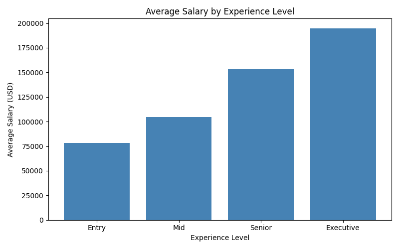
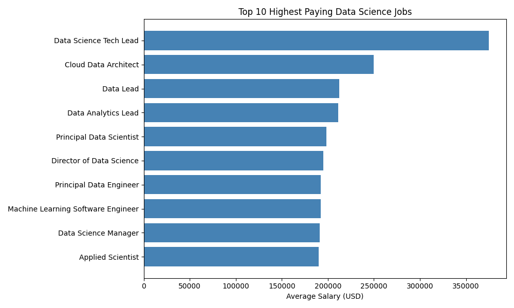
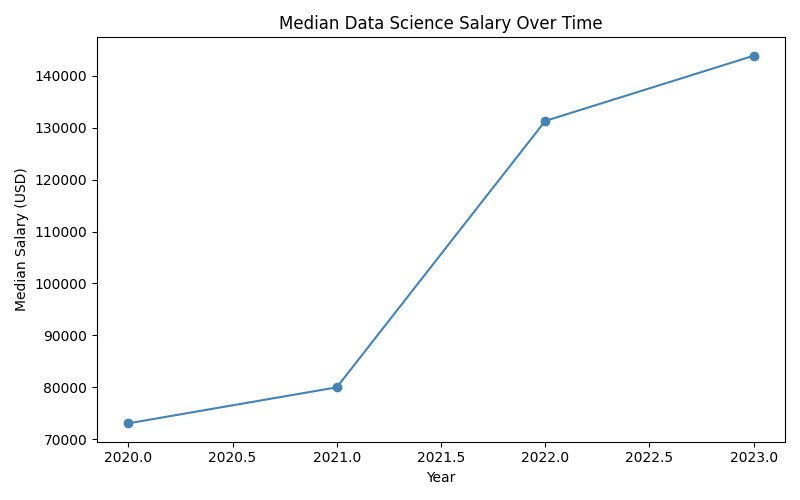
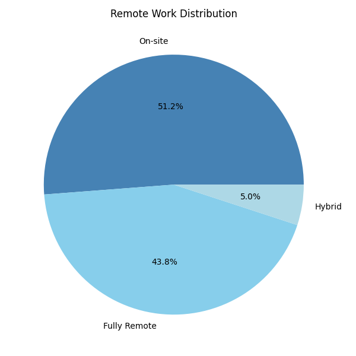

# Salary Analysis Project

## Overview

This project analyzes salary data from 3,755 records to identify compensation trends across job roles, experience levels, and remote work arrangements. The goal is to discover how different factors influence salaries and to demonstrate data analysis and visualization skills using Python

## Tools Used

* Python
* Pandas
* Matplotlib
* Git
* GitHub

## Dataset

The dataset contains salary information for data and analytics professionals, including job titles, experience levels, employment types, locations, and compensation data.

## Analysis Performed

* Salary by experience level
  
* Highest-paying job categories
  
* Salary trends
  
* Remote work compensation analysis
  

## Key Findings

* Senior-level employees generally earned higher salaries than entry-level employees.
* Compensation varied significantly across job roles.
* Remote work arrangements showed differences in compensation patterns.
* Salary distributions highlighted substantial variation within the industry.

## Project Files

* analysis.py
* ds_salaries.csv
* chart1_experience.png
* chart2_top_jobs.png
* chart3_salary_trend.png
* chart4_remote.png

## Skills Demonstrated

* Data Cleaning
* Exploratory Data Analysis (EDA)
* Data Visualization
* Statistical Interpretation
* Python Programming
* Business Insight Development
* Version Control with Git and GitHub
